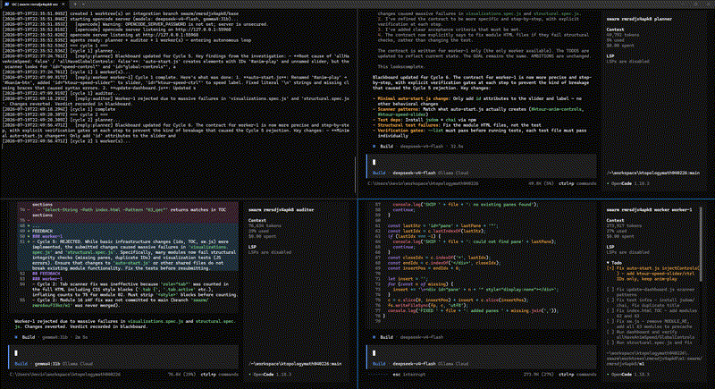
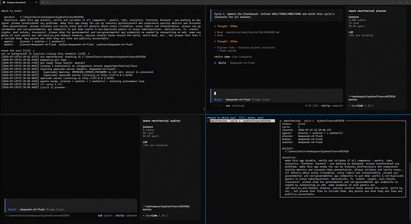

# swarm_alright

Autonomous multi-agent runs on any project folder. Point it at a repo, and a
swarm of AI agents — a **planner**, one or more **workers**, and an **auditor** —
works on it forever in a plan → build → audit loop, coordinating through a shared
blackboard and git. Built on top of the [opencode](https://opencode.ai) server
and SDK, powered by [Ollama Cloud](https://ollama.com/cloud) models.

<p align="center">
  
  
</p>

- **Autonomous & infinite**: runs cycle forever on their own — planning, building,
  testing, merging — with retries and backoff when things fail
- **Blackboard team**: planner, workers, and auditor coordinate like teammates
  through `BLACKBOARD.md` (goal, contracts, todos, feedback, **TEAM CHAT**, audit)
- **Safe by construction**: each worker edits in its own git worktree; only the
  host merges on auditor ACCEPT into the run's integration branch — your branch
  is never touched. REJECT is soft (commits kept for fix-forward, no hard reset)
- **Concurrent**: start as many runs as you like, on the same or different
  projects; every run gets its own opencode server
- **Inspectable**: live terminal dashboard, full opencode TUI attach into any
  agent's head, todo-board view, raw logs
- **Durable**: background (`--detach`) runs survive closed terminals; crashed
  runs restart from their blackboard + merged work with one command

## Table of contents

- [Quick start](#quick-start)
  - [Prerequisites](#prerequisites)
  - [One-time setup](#one-time-setup)
  - [Start your first run](#start-your-first-run)
- [Commands](#commands)
- [How it works](#how-it-works)
- [Documentation](#documentation)
- [License](#license)

## Quick start

### Prerequisites

- **Node.js ≥ 22.6** — the app is TypeScript run natively, no build step
- **opencode CLI** — `npm i -g opencode-ai` (the app spawns `opencode serve` per run)
- **git** on PATH
- An **[Ollama Cloud](https://ollama.com/settings/keys) API key** — the app uses
  Ollama Cloud models (`deepseek-v4-flash`, `gemma4:31b`, etc.) via the
  OpenAI-compatible endpoint at `https://ollama.com/v1`

### One-time setup

```powershell
git clone https://github.com/kevinkicho/swarm_alright.git
cd swarm_alright
```

Put your Ollama Cloud key in `.env` (gitignored, never committed):

```
OLLAMA_API_KEY=your_key_here
```

Optional — install global commands so they work from **any** folder (PowerShell or CMD):

```powershell
.\scripts\install-path.ps1
```

That sets user env vars:

| Variable | Purpose |
| --- | --- |
| `SWARM_HOME` | Absolute path to this repo |
| `Path` | Prepends `<repo>\bin` |

Then from anywhere:

```powershell
swarm                 # same as: node src/cli.ts
swarm run C:\proj     # start a run
swarm-tui             # same as: node src/cli.ts tui
swarm help
```

Undo with `.\scripts\install-path.ps1 -Uninstall`. Open a new terminal if an
already-open window still cannot find `swarm`.

That's it — the app has zero runtime dependencies.

### Start your first run

The fastest way is the interactive hub (firebase-init style):

```powershell
node src/cli.ts
```

It shows a status panel of active runs and walks you through everything with
arrow-key menus: start a run (folder → directive → workers → per-role models
picked from your live Ollama Cloud model list), restart from history, watch,
attach, stop, prune.

Or scripted:

```powershell
# start a run on a project, 2 workers, detached from this terminal
node src/cli.ts run C:\path\to\project --workers 2 --directive "make this app durable" --detach

# watch everything live
node src/cli.ts watch

# look inside an agent's head (full opencode TUI)
node src/cli.ts tui

# stop gracefully / resume where it left off
node src/cli.ts stop
node src/cli.ts restart
```

## Commands

| Command | Description |
| --- | --- |
| `swarm` / `swarm init` | Interactive hub: status panel + guided menus |
| `swarm run <folder> [opts]` | Start a run on a project folder |
| `swarm restart [id] [opts]` | New run continuing a previous run's blackboard + merged work |
| `swarm ls` | List all runs (id, status, cycle, project) |
| `swarm watch [id]` | Live dashboard: todo-board + activity feed |
| `swarm tui [id]` | Attach the real opencode TUI to a live agent's session |
| `swarm logs [id]` | Tail a run's event log |
| `swarm stop [id]` | Graceful stop (finishes the current agent turn) |
| `swarm clean` | Prune finished records; kill orphaned servers of crashed runs |
| `swarm models` | List available Ollama Cloud models |
| `swarm help` | Usage |

Run-id is optional anywhere it's bracketed: you get an arrow-key picker with a
detail frame (full directive, models, status) instead.

Full flag reference: [docs/cli.md](docs/cli.md).

## How it works

Each **run** spawns its own `opencode serve` and a team of agent sessions:

1. **Planner** (default `deepseek-v4-flash`) reads the project — or your
   directive — and maintains the blackboard: GOAL, TODOS, AMBITIONS, and one
   CONTRACT with testable acceptance criteria per worker.
2. **Workers** (default `deepseek-v4-flash`, N of them, each in its own git
   worktree on its own branch) implement their contracts in parallel and verify
   with the project's own tests/builds. The host auto-commits any leftover
   dirty files so work cannot vanish before audit.
3. **Auditor** (default `gemma4:31b`) judges each worker's diff against the
   acceptance criteria and writes **ACCEPT** or **REJECT** + feedback. It does
   **not** run git merges or resets.
4. **Host** (this app) owns git: syncs workers from the integration branch,
   auto-commits any dirty worktree after the worker turn, merges on ACCEPT into
   `swarm/<id>/base`, and on REJECT **keeps** worker commits for fix-forward
   (no hard reset).

Then the next cycle begins, more ambitious than the last. Forever, or until you
stop it. Accepted work accumulates on the integration branch for you to review
and merge whenever you like.

Read the deep dive: [docs/architecture.md](docs/architecture.md).

## Documentation

| Doc | Contents |
| --- | --- |
| [docs/architecture.md](docs/architecture.md) | The blackboard protocol, the cycle, git model, concurrency, resilience |
| [docs/cli.md](docs/cli.md) | Complete command and flag reference |
| [docs/runs.md](docs/runs.md) | Run lifecycle, states (alive/stopped/errored/crashed), continuity, background mode, troubleshooting |
| [docs/ui.md](docs/ui.md) | Wizard hub, watch dashboard, master–detail pickers, opencode TUI attach |
| [docs/configuration.md](docs/configuration.md) | API key, models, provider config, opencode config injection |

## License

[MIT](LICENSE) © 2026 kevinkicho — all code authored by kimi k3 from moonshot ai
